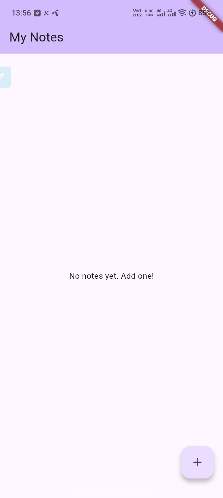
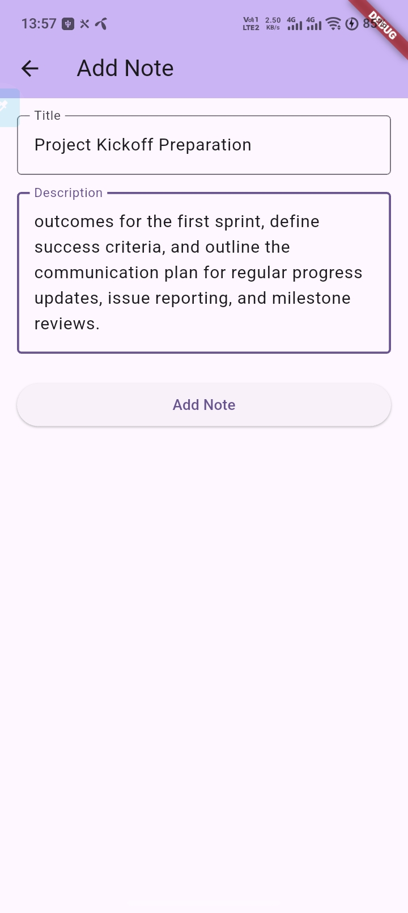
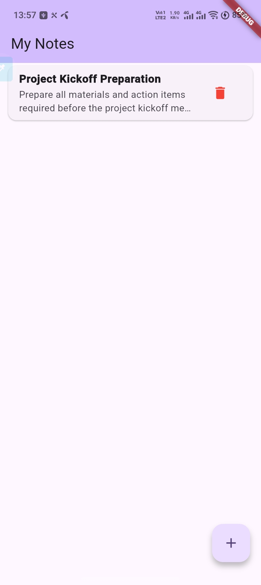
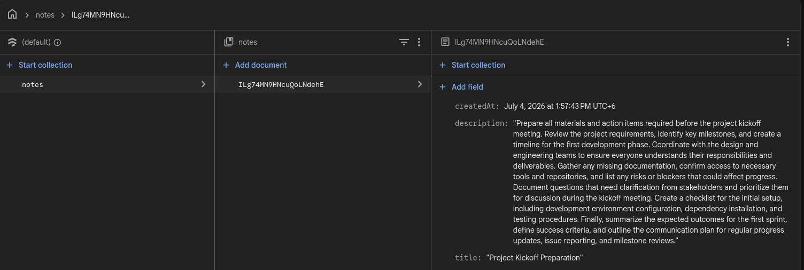

# Notes Management App (Flutter + Cloud Firestore)

A simple cross-platform **Notes Management Application** built with **Flutter** and backed by **Cloud Firestore**. Users can create, view, update, and delete notes — all synced live to the cloud.

This is the submission for **Module 6** of the Ostad Flutter course.

---

## Features

- **Create Note** — add a new note with a title and description.
- **View Notes** — every saved note appears in a list, ordered newest-first (live-updated via Firestore streams).
- **Update Note** — tap any note to edit its title and description.
- **Delete Note** — swipe-style delete via the trash icon, with a confirmation dialog.
- **Form validation** — both fields are required before a note can be saved.
- **Real-time sync** — the list uses a `StreamBuilder` over `notes.orderBy('createdAt', descending: true)`, so changes appear instantly across devices.

---

## Screenshots

<table>
  <tr>
    <td></td>
    <td></td>
  </tr>
  <tr>
    <td></td>
    <td></td>
  </tr>
</table>

---

## Tech stack

- **Flutter** (Material 3, dark-friendly theme).
- **firebase_core** `^3.12.1` — initializes Firebase at app startup.
- **cloud_firestore** `^5.6.6` — handles all CRUD against the `notes` collection.

Project layout:

```
lib/
├── main.dart                       # Firebase init + MaterialApp entry
├── models/
│   └── note.dart                   # Note model with Firestore Timestamp
├── services/
│   └── firestore_service.dart      # CRUD: getNotes / addNote / updateNote / deleteNote
└── screens/
    ├── notes_list_screen.dart      # StreamBuilder list + FAB to add
    └── note_form_screen.dart       # Add/Edit form with validation
```

---

## Prerequisites

- Flutter SDK (Dart `^3.11.4`) — verify with `flutter --version`.
- Android Studio (for the Android emulator / SDK) and/or Xcode (for iOS, macOS only).
- A Firebase project with Cloud Firestore enabled (test mode).

---

## How to run

1. **Clone the repository**

   ```bash
   git clone https://github.com/b-Istiak-s/assignment6.git
   cd assignment6
   ```

2. **Install dependencies**

   ```bash
   flutter pub get
   ```

3. **Add your Firebase config files**

   - Create a project at the [Firebase Console](https://console.firebase.google.com/), enable Cloud Firestore (test mode).
   - Register Android app (`com.nadb.assignment`) → download `google-services.json` → place at `android/app/`.
   - Register iOS app (`com.nadb.assignment`) → download `GoogleService-Info.plist` → place at `ios/Runner/` and add to Xcode project.

4. **Run on a device or emulator**

   ```bash
   # List available devices
   flutter devices

   # Run on the first available one
   flutter run
   ```

   Or target a specific platform:

   ```bash
   flutter run -d android
   flutter run -d ios        # macOS only
   ```

5. **Try it out**
   - Tap the **+** FAB to add a note.
   - Tap a note to edit it.
   - Tap the red trash icon to delete (with confirmation).
